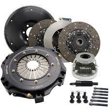

# 🗄️Test
## SECOND LARGEST
### THIRD LARGEST
#### FOURTH LARGEST
##### FIFTH LARGEST
###### 제목6 LARGEST

- LIST1
- LIST2
- LIST3

1. LIST1
2. LIST2
3. LIST3

* git tutorial
  * git clone
  * git pull
  * git add .
    * git commit -m 
   
:smile::smile::smile::smile::smile:

- image




- external link

[link to site](https://www.google.com/search?q=clutch&sxsrf=AOaemvICWqXkE9B7sIoxEvqvWi2hL1GaKw:1637580610692&source=lnms&tbm=isch&sa=X&ved=2ahUKEwi6_tyU76v0AhWK32EKHSdYABoQ_AUoAXoECAEQAw&biw=1853&bih=948&dpr=1#imgrc=DNxJPe4nnPI2NM)

- internal link

[link to site](./images/clutch.jpeg)

-edited from atom

- 소스코드 작성

```c++
#include <iostream>
using namespace std;
int main(){
  cout<<"hello world!"<endl;
  retrun 0;
}
```

- 인용구문

> '공부합시다.' -송대근-

- 테이블 작성

이름|국어|영어|수학
---|---|---|---|
송대근|99|98|97|

- 강조 

**치킨** ~~먹고~~ 싶다. 

